P8130\_hw5\_jsg2145
================
Jared Garfinkel
12/6/2019

    ## Classes 'tbl_df', 'tbl' and 'data.frame':    50 obs. of  9 variables:
    ##  $ states    : chr  "Alabama" "Alaska" "Arizona" "Arkansas" ...
    ##  $ population: num  3615 365 2212 2110 21198 ...
    ##  $ income    : num  3624 6315 4530 3378 5114 ...
    ##  $ illiteracy: num  2.1 1.5 1.8 1.9 1.1 0.7 1.1 0.9 1.3 2 ...
    ##  $ life_exp  : num  69 69.3 70.5 70.7 71.7 ...
    ##  $ murder    : num  15.1 11.3 7.8 10.1 10.3 6.8 3.1 6.2 10.7 13.9 ...
    ##  $ hs_grad   : num  41.3 66.7 58.1 39.9 62.6 63.9 56 54.6 52.6 40.6 ...
    ##  $ frost     : num  20 152 15 65 20 166 139 103 11 60 ...
    ##  $ area      : num  50708 566432 113417 51945 156361 ...

| Var.1                                                | Overall..N.50.                   |
| :--------------------------------------------------- | :------------------------------- |
| Population                                           |                                  |
| \- Mean (SD)                                         | 4246.420 (4464.491)              |
| \- Median (Q1, Q3)                                   | 2838.500 (1079.500, 4968.500)    |
| \- Min - Max                                         | 365.000 - 21198.000              |
| Per Capita Income                                    |                                  |
| \- Mean (SD)                                         | 4435.800 (614.470)               |
| \- Median (Q1, Q3)                                   | 4519.000 (3992.750, 4813.500)    |
| \- Min - Max                                         | 3098.000 - 6315.000              |
| Illiteracy, Percent of Population                    |                                  |
| \- Mean (SD)                                         | 1.170 (0.610)                    |
| \- Median (Q1, Q3)                                   | 0.950 (0.625, 1.575)             |
| \- Min - Max                                         | 0.500 - 2.800                    |
| Life Expectancy in Years                             |                                  |
| \- Mean (SD)                                         | 70.879 (1.342)                   |
| \- Median (Q1, Q3)                                   | 70.675 (70.117, 71.893)          |
| \- Min - Max                                         | 67.960 - 73.600                  |
| Murder Rate per 100,000                              |                                  |
| \- Mean (SD)                                         | 7.378 (3.692)                    |
| \- Median (Q1, Q3)                                   | 6.850 (4.350, 10.675)            |
| \- Min - Max                                         | 1.400 - 15.100                   |
| Percent High-School Graduates                        |                                  |
| \- Mean (SD)                                         | 53.108 (8.077)                   |
| \- Median (Q1, Q3)                                   | 53.250 (48.050, 59.150)          |
| \- Min - Max                                         | 37.800 - 67.300                  |
| Mean Number of Days with Minimum Temp Below Freezing |                                  |
| \- Mean (SD)                                         | 104.460 (51.981)                 |
| \- Median (Q1, Q3)                                   | 114.500 (66.250, 139.750)        |
| \- Min - Max                                         | 0.000 - 188.000                  |
| Land Area (sq mi)                                    |                                  |
| \- Mean (SD)                                         | 70735.880 (85327.300)            |
| \- Median (Q1, Q3)                                   | 54277.000 (36985.250, 81162.500) |
| \- Min - Max                                         | 1049.000 - 566432.000            |

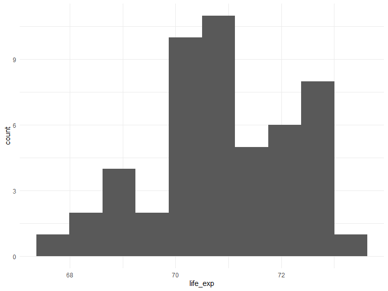

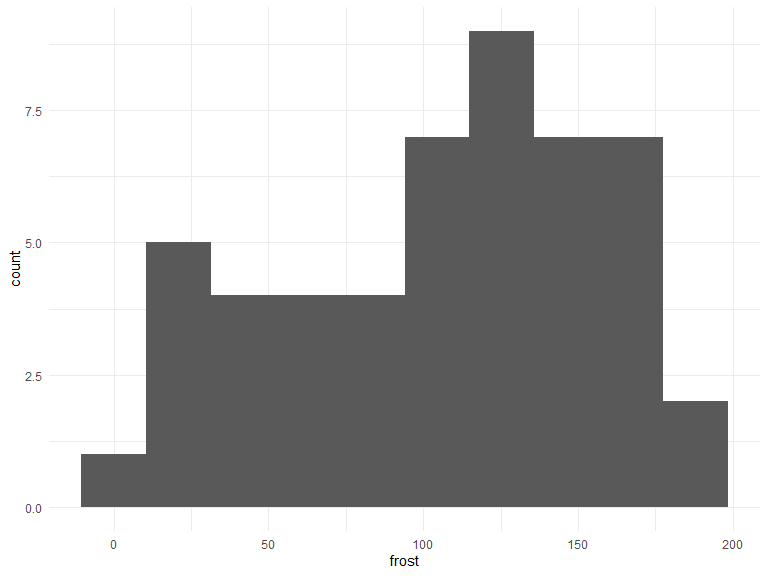

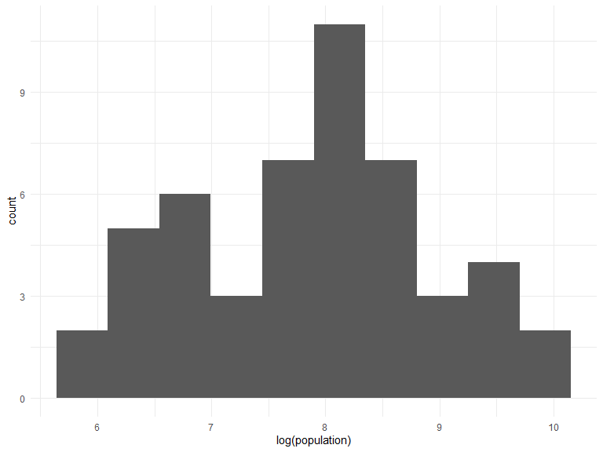

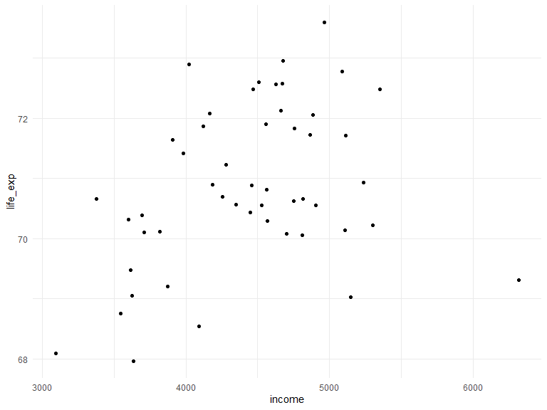

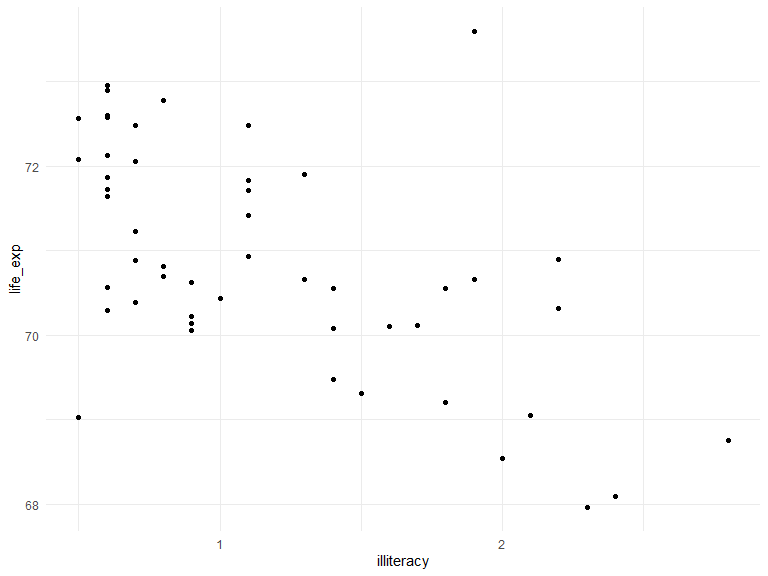

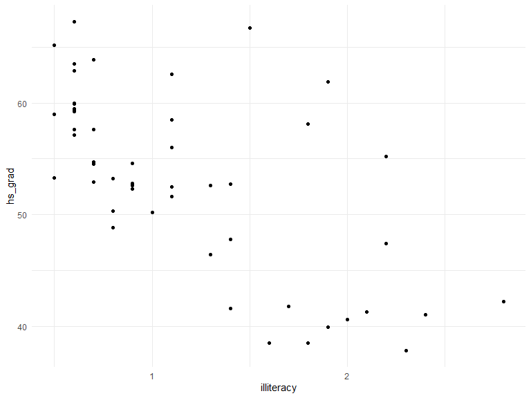

    ##    hs_grad illiteracy 
    ##   1.760244   1.760244

    ## 
    ## Call:
    ## lm(formula = life_exp ~ hs_grad + illiteracy, data = df)
    ## 
    ## Residuals:
    ##      Min       1Q   Median       3Q      Max 
    ## -3.07477 -0.43933 -0.09857  0.63861  2.80117 
    ## 
    ## Coefficients:
    ##             Estimate Std. Error t value Pr(>|t|)    
    ## (Intercept) 68.77521    1.59233  43.192   <2e-16 ***
    ## hs_grad      0.05719    0.02463   2.322   0.0246 *  
    ## illiteracy  -0.79801    0.32638  -2.445   0.0183 *  
    ## ---
    ## Signif. codes:  0 '***' 0.001 '**' 0.01 '*' 0.05 '.' 0.1 ' ' 1
    ## 
    ## Residual standard error: 1.05 on 47 degrees of freedom
    ## Multiple R-squared:  0.4136, Adjusted R-squared:  0.3886 
    ## F-statistic: 16.57 on 2 and 47 DF,  p-value: 3.574e-06

    ## Start:  AIC=-27.02
    ## life_exp ~ murder + hs_grad + ln_pop + frost + income
    ## 
    ##           Df Sum of Sq    RSS     AIC
    ## - income   1     0.011 22.921 -28.998
    ## <none>                 22.911 -27.021
    ## - frost    1     2.107 25.017 -24.623
    ## - ln_pop   1     2.279 25.189 -24.280
    ## - hs_grad  1     4.436 27.347 -20.172
    ## - murder   1    33.706 56.616  16.214
    ## 
    ## Step:  AIC=-29
    ## life_exp ~ murder + hs_grad + ln_pop + frost
    ## 
    ##           Df Sum of Sq    RSS     AIC
    ## <none>                 22.921 -28.998
    ## + income   1     0.011 22.911 -27.021
    ## - frost    1     2.214 25.135 -26.387
    ## - ln_pop   1     2.450 25.372 -25.920
    ## - hs_grad  1     6.959 29.881 -17.741
    ## - murder   1    34.109 57.031  14.578

    ## Start:  AIC=-27.02
    ## life_exp ~ murder + hs_grad + ln_pop + frost + income
    ## 
    ##           Df Sum of Sq    RSS     AIC
    ## - income   1     0.011 22.921 -28.998
    ## <none>                 22.911 -27.021
    ## - frost    1     2.107 25.017 -24.623
    ## - ln_pop   1     2.279 25.189 -24.280
    ## - hs_grad  1     4.436 27.347 -20.172
    ## - murder   1    33.706 56.616  16.214
    ## 
    ## Step:  AIC=-29
    ## life_exp ~ murder + hs_grad + ln_pop + frost
    ## 
    ##           Df Sum of Sq    RSS     AIC
    ## <none>                 22.921 -28.998
    ## - frost    1     2.214 25.135 -26.387
    ## - ln_pop   1     2.450 25.372 -25.920
    ## - hs_grad  1     6.959 29.881 -17.741
    ## - murder   1    34.109 57.031  14.578

    ## Start:  AIC=-23.6
    ## life_exp ~ (states + population + income + illiteracy + murder + 
    ##     hs_grad + frost + area + ln_pop + ln_area) - states - population - 
    ##     area

    ## $which
    ##       1     2     3     4     5     6     7
    ## 1 FALSE FALSE  TRUE FALSE FALSE FALSE FALSE
    ## 1 FALSE  TRUE FALSE FALSE FALSE FALSE FALSE
    ## 2 FALSE FALSE  TRUE  TRUE FALSE FALSE FALSE
    ## 2 FALSE FALSE  TRUE FALSE  TRUE FALSE FALSE
    ## 3 FALSE FALSE  TRUE  TRUE FALSE  TRUE FALSE
    ## 3 FALSE FALSE  TRUE  TRUE  TRUE FALSE FALSE
    ## 4 FALSE FALSE  TRUE  TRUE  TRUE  TRUE FALSE
    ## 4 FALSE  TRUE  TRUE  TRUE FALSE  TRUE FALSE
    ## 5 FALSE FALSE  TRUE  TRUE  TRUE  TRUE  TRUE
    ## 5 FALSE  TRUE  TRUE  TRUE  TRUE  TRUE FALSE
    ## 6 FALSE  TRUE  TRUE  TRUE  TRUE  TRUE  TRUE
    ## 6  TRUE FALSE  TRUE  TRUE  TRUE  TRUE  TRUE
    ## 7  TRUE  TRUE  TRUE  TRUE  TRUE  TRUE  TRUE
    ## 
    ## $label
    ## [1] "(Intercept)" "1"           "2"           "3"           "4"          
    ## [6] "5"           "6"           "7"          
    ## 
    ## $size
    ##  [1] 2 2 3 3 4 4 5 5 6 6 7 7 8
    ## 
    ## $Cp
    ##  [1] 17.907063 61.040217 11.207857 14.094038  4.612501  5.050598  2.506440
    ##  [8]  4.558615  4.106358  4.410760  6.003263  6.103156  8.000000

    ## $which
    ##       1     2     3     4     5     6     7
    ## 1 FALSE FALSE  TRUE FALSE FALSE FALSE FALSE
    ## 1 FALSE  TRUE FALSE FALSE FALSE FALSE FALSE
    ## 2 FALSE FALSE  TRUE  TRUE FALSE FALSE FALSE
    ## 2 FALSE FALSE  TRUE FALSE  TRUE FALSE FALSE
    ## 3 FALSE FALSE  TRUE  TRUE FALSE  TRUE FALSE
    ## 3 FALSE FALSE  TRUE  TRUE  TRUE FALSE FALSE
    ## 4 FALSE FALSE  TRUE  TRUE  TRUE  TRUE FALSE
    ## 4 FALSE  TRUE  TRUE  TRUE FALSE  TRUE FALSE
    ## 5 FALSE FALSE  TRUE  TRUE  TRUE  TRUE  TRUE
    ## 5 FALSE  TRUE  TRUE  TRUE  TRUE  TRUE FALSE
    ## 6 FALSE  TRUE  TRUE  TRUE  TRUE  TRUE  TRUE
    ## 6  TRUE FALSE  TRUE  TRUE  TRUE  TRUE  TRUE
    ## 7  TRUE  TRUE  TRUE  TRUE  TRUE  TRUE  TRUE
    ## 
    ## $label
    ## [1] "(Intercept)" "1"           "2"           "3"           "4"          
    ## [6] "5"           "6"           "7"          
    ## 
    ## $size
    ##  [1] 2 2 3 3 4 4 5 5 6 6 7 7 8
    ## 
    ## $adjr2
    ##  [1] 0.6015893 0.3326876 0.6484991 0.6301232 0.6967729 0.6939230 0.7173392
    ##  [8] 0.7036925 0.7136360 0.7115658 0.7076938 0.7069987 0.7007574

    ## Subset selection object
    ## Call: regsubsets.formula(life_exp ~ ., data = df)
    ## 7 Variables  (and intercept)
    ##            Forced in Forced out
    ## income         FALSE      FALSE
    ## illiteracy     FALSE      FALSE
    ## murder         FALSE      FALSE
    ## hs_grad        FALSE      FALSE
    ## frost          FALSE      FALSE
    ## ln_pop         FALSE      FALSE
    ## ln_area        FALSE      FALSE
    ## 1 subsets of each size up to 7
    ## Selection Algorithm: exhaustive
    ##          income illiteracy murder hs_grad frost ln_pop ln_area
    ## 1  ( 1 ) " "    " "        "*"    " "     " "   " "    " "    
    ## 2  ( 1 ) " "    " "        "*"    "*"     " "   " "    " "    
    ## 3  ( 1 ) " "    " "        "*"    "*"     " "   "*"    " "    
    ## 4  ( 1 ) " "    " "        "*"    "*"     "*"   "*"    " "    
    ## 5  ( 1 ) " "    " "        "*"    "*"     "*"   "*"    "*"    
    ## 6  ( 1 ) " "    "*"        "*"    "*"     "*"   "*"    "*"    
    ## 7  ( 1 ) "*"    "*"        "*"    "*"     "*"   "*"    "*"

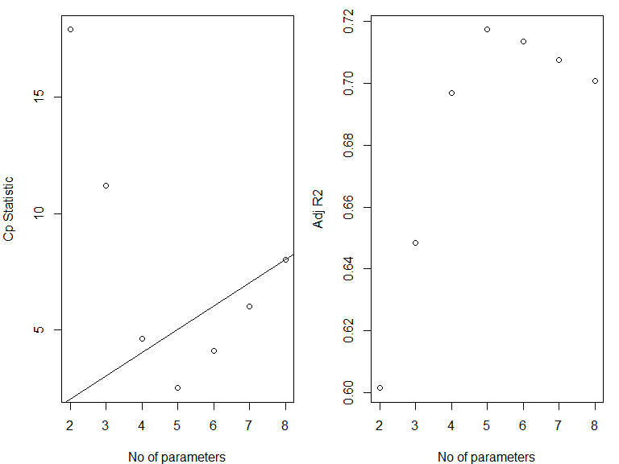

    ## [1] 114.8959

    ## [1] 126.368

    ## [1] 116.423

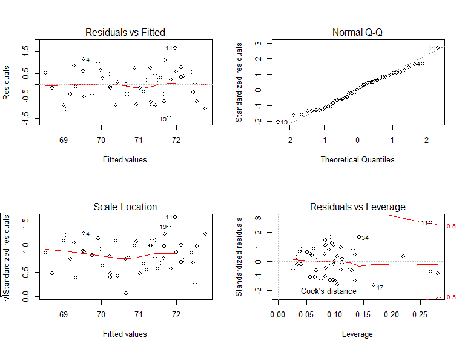

    ## Influence measures of
    ##   lm(formula = life_exp ~ murder + hs_grad + ln_pop + frost, data = df) :
    ## 
    ##       dfb.1_  dfb.mrdr  dfb.hs_g  dfb.ln_p dfb.frst    dffit cov.r
    ## 1   0.093164  1.54e-01 -0.065645 -0.095658 -0.09185  0.31415 1.199
    ## 2   0.082181 -3.25e-01 -0.245469  0.197451 -0.09938 -0.43712 1.444
    ## 3  -0.111760  9.09e-02 -0.197686  0.165137  0.47189 -0.54168 1.049
    ## 4   0.405014 -2.09e-02 -0.391545 -0.229081 -0.12787  0.54428 0.893
    ## 5  -0.113683  2.57e-02  0.117306  0.092384 -0.05448  0.17194 1.418
    ## 6  -0.253202  1.56e-01  0.226235  0.115453  0.21261  0.36539 1.081
    ## 7  -0.008355 -7.33e-02 -0.010773  0.046640  0.02041  0.11951 1.156
    ## 8  -0.255420  3.81e-02  0.030851  0.306995  0.14241 -0.36906 1.006
    ## 9  -0.000252  8.87e-05  0.000496  0.000304 -0.00098  0.00153 1.242
    ## 10 -0.011381 -3.84e-02  0.027384  0.003328 -0.00619 -0.07332 1.233
    ## 11  0.619189 -4.06e-01  0.566152 -0.867924 -1.53843  1.74328 0.645
    ## 12  0.042239 -7.07e-03  0.040647 -0.084505 -0.02273  0.14513 1.128
    ## 13  0.040766 -2.54e-02 -0.011148 -0.040331 -0.03507 -0.05634 1.258
    ## 14  0.020006  3.59e-04 -0.000341 -0.029438 -0.02039 -0.04467 1.160
    ## 15 -0.002542 -1.15e-02  0.001721  0.006678  0.00138  0.01842 1.200
    ## 16 -0.024034 -6.62e-02  0.070901  0.019021 -0.03484  0.17091 1.081
    ## 17  0.179977  4.82e-02 -0.309068 -0.034027  0.09013  0.40026 1.040
    ## 18 -0.087740 -5.03e-02  0.055557  0.064083  0.10843 -0.21257 1.208
    ## 19 -0.231935  2.90e-01  0.190679  0.118504 -0.12807 -0.57083 0.732
    ## 20  0.029818 -2.32e-02 -0.008596 -0.036916 -0.02062 -0.09682 1.104
    ## 21  0.088945  1.98e-01 -0.065584 -0.178215  0.05959 -0.32200 1.072
    ## 22 -0.238067  1.95e-01  0.081773  0.205843  0.20996  0.33627 1.134
    ## 23 -0.068348 -1.26e-01 -0.003045  0.136503  0.09043  0.25074 1.142
    ## 24 -0.241655 -1.32e-01  0.206069  0.190293  0.10364 -0.43729 1.015
    ## 25 -0.028918  4.12e-02 -0.029366  0.053563  0.06005  0.13361 1.106
    ## 26 -0.051619 -1.43e-02 -0.047074  0.128833 -0.06411 -0.27052 1.031
    ## 27  0.012590 -7.07e-02  0.015810 -0.003323 -0.00228  0.12965 1.138
    ## 28  0.187361 -4.27e-01 -0.263770  0.123993 -0.27399 -0.53116 1.437
    ## 29 -0.041228  3.78e-02  0.016411  0.048017 -0.06156 -0.16515 1.148
    ## 30  0.084452  1.27e-01  0.034420 -0.205562 -0.05363 -0.28469 1.048
    ## 31  0.003840  6.84e-02  0.025462 -0.048751  0.02257  0.10211 1.168
    ## 32 -0.046848  2.14e-02  0.019447  0.049608  0.01661  0.06314 1.257
    ## 33 -0.014411 -5.35e-03  0.032781 -0.004587 -0.00777 -0.04616 1.226
    ## 34  0.395237 -3.40e-01 -0.397658 -0.205286  0.18543  0.68500 0.955
    ## 35  0.086282 -3.83e-03 -0.013070 -0.113939 -0.06479 -0.13488 1.195
    ## 36  0.023677 -2.77e-02 -0.012390 -0.005569 -0.02817  0.05530 1.145
    ## 37 -0.038771  9.76e-02 -0.053195  0.027664  0.15119 -0.18490 1.247
    ## 38  0.191811  1.12e-01  0.079926 -0.378227 -0.19146 -0.46026 1.007
    ## 39  0.147326 -1.26e-01 -0.128814 -0.067792 -0.02902  0.18497 1.261
    ## 40 -0.331641 -7.49e-02  0.394591  0.163742  0.04123 -0.55501 0.930
    ## 41  0.062820 -5.91e-02 -0.050707 -0.038415  0.01987  0.11216 1.234
    ## 42  0.084329  3.96e-02 -0.134423 -0.011693 -0.00500  0.22505 1.096
    ## 43 -0.132948  1.25e-01  0.033883  0.197414 -0.09183  0.44100 0.961
    ## 44 -0.108486  1.84e-02  0.255592 -0.036620 -0.00818  0.34331 1.058
    ## 45  0.115480  5.28e-02 -0.008974 -0.204807  0.10503  0.33120 1.066
    ## 46  0.001017 -6.91e-03  0.011578 -0.012402 -0.00348 -0.04074 1.152
    ## 47  0.023176  3.31e-01 -0.349437 -0.024418  0.57841 -0.75432 0.987
    ## 48 -0.332040  1.66e-01  0.359058  0.131277  0.03700 -0.42175 1.010
    ## 49 -0.028050 -8.11e-02 -0.025452  0.085101  0.05038  0.14969 1.184
    ## 50 -0.006833 -1.15e-01 -0.089306  0.135985 -0.07840 -0.24759 1.228
    ##      cook.d    hat inf
    ## 1  1.99e-02 0.1324    
    ## 2  3.86e-02 0.2691   *
    ## 3  5.76e-02 0.1350    
    ## 4  5.68e-02 0.0920    
    ## 5  6.03e-03 0.2200   *
    ## 6  2.66e-02 0.0981    
    ## 7  2.91e-03 0.0574    
    ## 8  2.68e-02 0.0757    
    ## 9  4.78e-07 0.0989    
    ## 10 1.10e-03 0.0976    
    ## 11 5.23e-01 0.2683   *
    ## 12 4.27e-03 0.0509    
    ## 13 6.49e-04 0.1131    
    ## 14 4.08e-04 0.0406    
    ## 15 6.94e-05 0.0677    
    ## 16 5.88e-03 0.0412    
    ## 17 3.17e-02 0.0941    
    ## 18 9.17e-03 0.1111    
    ## 19 6.04e-02 0.0667    
    ## 20 1.90e-03 0.0260    
    ## 21 2.07e-02 0.0827    
    ## 22 2.27e-02 0.1101    
    ## 23 1.27e-02 0.0887    
    ## 24 3.76e-02 0.0967    
    ## 25 3.61e-03 0.0381    
    ## 26 1.46e-02 0.0556    
    ## 27 3.41e-03 0.0509    
    ## 28 5.68e-02 0.2819   *
    ## 29 5.53e-03 0.0666    
    ## 30 1.61e-02 0.0643    
    ## 31 2.12e-03 0.0594    
    ## 32 8.15e-04 0.1129    
    ## 33 4.36e-04 0.0899    
    ## 34 9.02e-02 0.1422    
    ## 35 3.70e-03 0.0844    
    ## 36 6.24e-04 0.0327    
    ## 37 6.96e-03 0.1264    
    ## 38 4.15e-02 0.1003    
    ## 39 6.96e-03 0.1348    
    ## 40 5.94e-02 0.1037    
    ## 41 2.57e-03 0.1042    
    ## 42 1.02e-02 0.0626    
    ## 43 3.79e-02 0.0830    
    ## 44 2.34e-02 0.0841    
    ## 45 2.18e-02 0.0833    
    ## 46 3.39e-04 0.0337    
    ## 47 1.09e-01 0.1682    
    ## 48 3.50e-02 0.0909    
    ## 49 4.56e-03 0.0817    
    ## 50 1.24e-02 0.1299

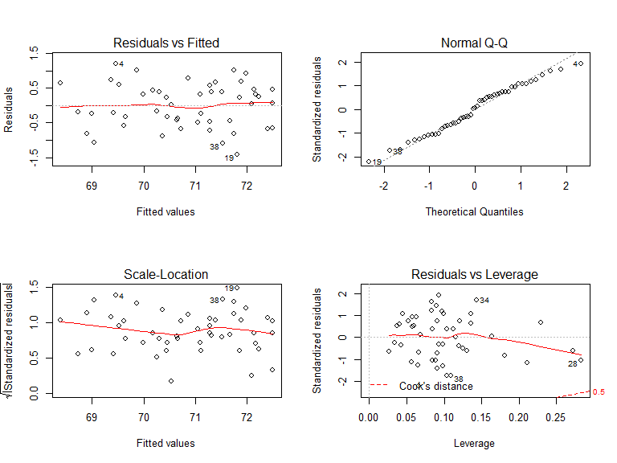

    ## 
    ## Call:
    ## lm(formula = life_exp ~ murder + hs_grad + ln_pop + frost, data = df.no11)
    ## 
    ## Residuals:
    ##      Min       1Q   Median       3Q      Max 
    ## -1.41708 -0.45880  0.03924  0.46286  1.20332 
    ## 
    ## Coefficients:
    ##              Estimate Std. Error t value Pr(>|t|)    
    ## (Intercept) 67.906960   1.344438  50.510  < 2e-16 ***
    ## murder      -0.276679   0.033203  -8.333 1.35e-10 ***
    ## hs_grad      0.046799   0.013953   3.354  0.00165 ** 
    ## ln_pop       0.337449   0.109043   3.095  0.00342 ** 
    ## frost       -0.001632   0.002610  -0.625  0.53499    
    ## ---
    ## Signif. codes:  0 '***' 0.001 '**' 0.01 '*' 0.05 '.' 0.1 ' ' 1
    ## 
    ## Residual standard error: 0.6621 on 44 degrees of freedom
    ## Multiple R-squared:  0.7611, Adjusted R-squared:  0.7394 
    ## F-statistic: 35.05 on 4 and 44 DF,  p-value: 3.709e-13

    ## 
    ## Call:
    ## lm(formula = life_exp ~ murder + hs_grad + ln_pop + frost, data = df)
    ## 
    ## Residuals:
    ##      Min       1Q   Median       3Q      Max 
    ## -1.41760 -0.43880  0.02539  0.52066  1.63048 
    ## 
    ## Coefficients:
    ##              Estimate Std. Error t value Pr(>|t|)    
    ## (Intercept) 68.720810   1.416828  48.503  < 2e-16 ***
    ## murder      -0.290016   0.035440  -8.183 1.87e-10 ***
    ## hs_grad      0.054550   0.014758   3.696 0.000591 ***
    ## ln_pop       0.246836   0.112539   2.193 0.033491 *  
    ## frost       -0.005174   0.002482  -2.085 0.042779 *  
    ## ---
    ## Signif. codes:  0 '***' 0.001 '**' 0.01 '*' 0.05 '.' 0.1 ' ' 1
    ## 
    ## Residual standard error: 0.7137 on 45 degrees of freedom
    ## Multiple R-squared:  0.7404, Adjusted R-squared:  0.7173 
    ## F-statistic: 32.09 on 4 and 45 DF,  p-value: 1.17e-12

This is evidence that the influential point at observation 11 causes a
variable, frost, to become not significant.

    ## Linear Regression 
    ## 
    ## 50 samples
    ##  4 predictor
    ## 
    ## No pre-processing
    ## Resampling: Cross-Validated (10 fold) 
    ## Summary of sample sizes: 45, 45, 45, 43, 46, 46, ... 
    ## Resampling results:
    ## 
    ##   RMSE       Rsquared   MAE      
    ##   0.7617203  0.7674965  0.6665966
    ## 
    ## Tuning parameter 'intercept' was held constant at a value of TRUE

    ## 
    ## Call:
    ## lm(formula = .outcome ~ ., data = dat)
    ## 
    ## Coefficients:
    ## (Intercept)       murder      hs_grad       ln_pop        frost  
    ##   68.720810    -0.290016     0.054550     0.246836    -0.005174

    ##         RMSE  Rsquared       MAE Resample
    ## 1  0.7272280 0.6869238 0.6674696   Fold01
    ## 2  0.4862708 0.8874543 0.4410437   Fold02
    ## 3  0.7590972 0.7790884 0.6884443   Fold03
    ## 4  0.3336417 0.8595139 0.3089362   Fold04
    ## 5  0.5477149 0.8501890 0.4592053   Fold05
    ## 6  1.3014101 0.9750501 1.1120862   Fold06
    ## 7  1.1677214 0.3498620 1.0918029   Fold07
    ## 8  0.9104841 0.5910320 0.6811910   Fold08
    ## 9  0.6442980 0.8436584 0.6033627   Fold09
    ## 10 0.7393366 0.8521929 0.6124238   Fold10

    ## [1] 0.1819439

    ## 
    ## Call:
    ## lm(formula = life_exp ~ murder + hs_grad + ln_pop + frost, data = df)
    ## 
    ## Residuals:
    ##      Min       1Q   Median       3Q      Max 
    ## -1.41760 -0.43880  0.02539  0.52066  1.63048 
    ## 
    ## Coefficients:
    ##              Estimate Std. Error t value Pr(>|t|)    
    ## (Intercept) 68.720810   1.416828  48.503  < 2e-16 ***
    ## murder      -0.290016   0.035440  -8.183 1.87e-10 ***
    ## hs_grad      0.054550   0.014758   3.696 0.000591 ***
    ## ln_pop       0.246836   0.112539   2.193 0.033491 *  
    ## frost       -0.005174   0.002482  -2.085 0.042779 *  
    ## ---
    ## Signif. codes:  0 '***' 0.001 '**' 0.01 '*' 0.05 '.' 0.1 ' ' 1
    ## 
    ## Residual standard error: 0.7137 on 45 degrees of freedom
    ## Multiple R-squared:  0.7404, Adjusted R-squared:  0.7173 
    ## F-statistic: 32.09 on 4 and 45 DF,  p-value: 1.17e-12

Through automatic and criterion based model building procedures, it was
determined that a final model including the murder rate, high school
graduation rate, log of the state population, and mean number of days
below freezing each year (frost days) could predict the life expectancy
in a state with an adjusted r-squared of 0.77 \(\pm\) 0.18. There was
one leverage point that, when removed, caused one variable, frost days,
to become not significant in the model. This indicates that there may be
evidence that a model with three variables, murder rate, high\_school
graduation rate, and the log of the state population is the best model.

## Problem 2

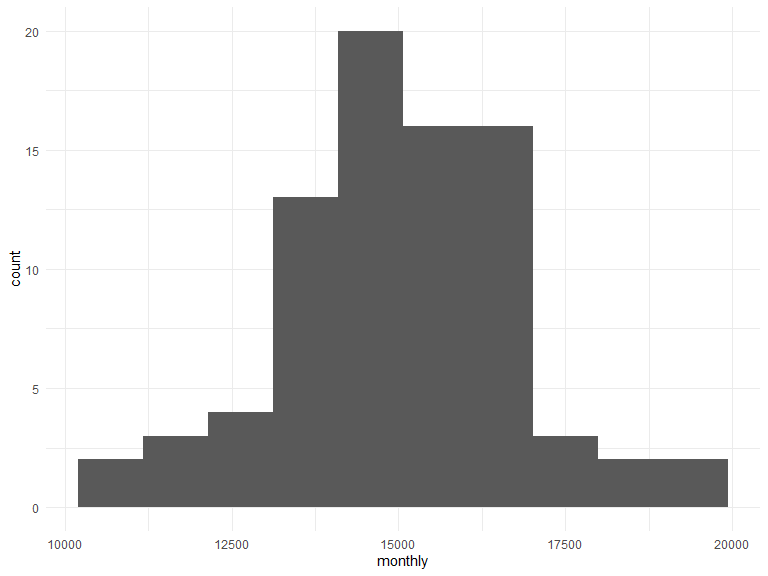

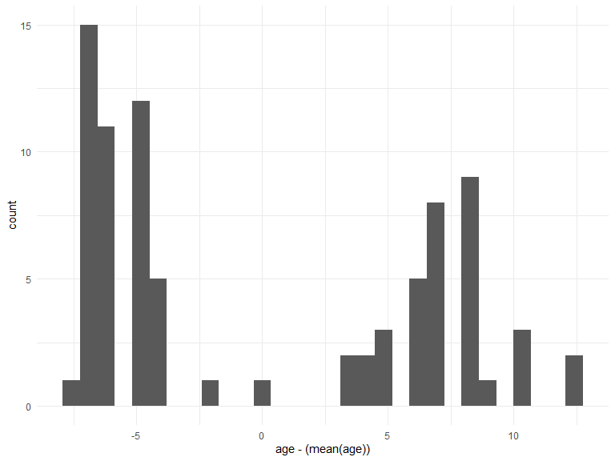

    ## 
    ## Call:
    ## lm(formula = monthly ~ ., data = rent_df)
    ## 
    ## Residuals:
    ##     Min      1Q  Median      3Q     Max 
    ## -3187.2  -591.1   -91.0   557.9  2944.1 
    ## 
    ## Coefficients:
    ##                Estimate Std. Error t value Pr(>|t|)    
    ## (Intercept)   1.220e+04  5.780e+02  21.110  < 2e-16 ***
    ## age          -1.420e+02  2.134e+01  -6.655 3.89e-09 ***
    ## taxes         2.820e+02  6.317e+01   4.464 2.75e-05 ***
    ## vacancy_rate  6.193e+02  1.087e+03   0.570     0.57    
    ## sq_footage    7.924e-03  1.385e-03   5.722 1.98e-07 ***
    ## ---
    ## Signif. codes:  0 '***' 0.001 '**' 0.01 '*' 0.05 '.' 0.1 ' ' 1
    ## 
    ## Residual standard error: 1137 on 76 degrees of freedom
    ## Multiple R-squared:  0.5847, Adjusted R-squared:  0.5629 
    ## F-statistic: 26.76 on 4 and 76 DF,  p-value: 7.272e-14

After fitting an initial model including all available variables, it
appears that the age of the property, the taxes, and square footage are
significantly associated with the outcome, monthly rent. However, the
vacancy rate does not appear to be associated with the monthly rent.

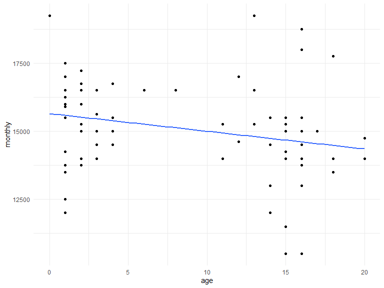

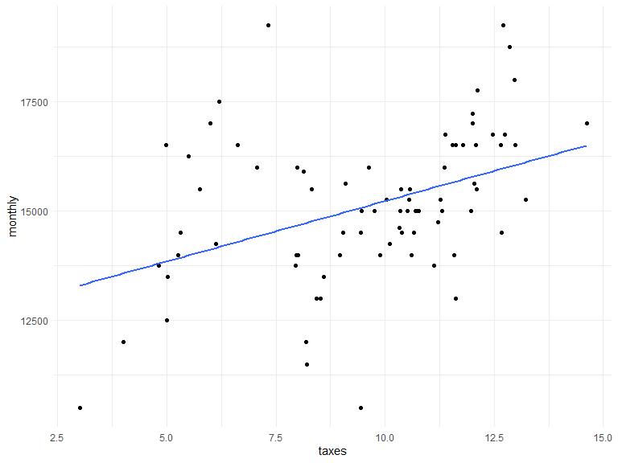

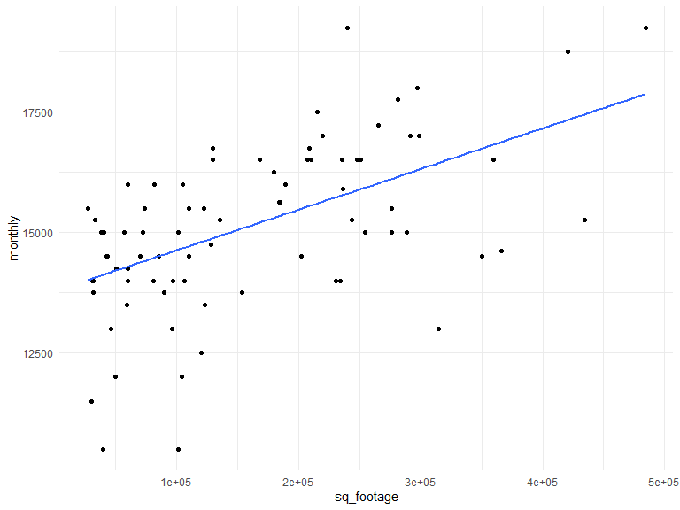

Square footage and taxes appear to be directly related with the monthly
rent of each property, while the age of the property might be slightly
inversely related to the monthly rent. There appear to be mostly homes
younger than five years old or older than ten years old in this data.

    ## 
    ## Call:
    ## lm(formula = monthly ~ . - vacancy_rate, data = rent_df)
    ## 
    ## Residuals:
    ##     Min      1Q  Median      3Q     Max 
    ## -3062.0  -643.7  -101.3   567.2  2958.3 
    ## 
    ## Coefficients:
    ##               Estimate Std. Error t value Pr(>|t|)    
    ## (Intercept)  1.237e+04  4.928e+02  25.100  < 2e-16 ***
    ## age         -1.442e+02  2.092e+01  -6.891 1.33e-09 ***
    ## taxes        2.672e+02  5.729e+01   4.663 1.29e-05 ***
    ## sq_footage   8.178e-03  1.305e-03   6.265 1.97e-08 ***
    ## ---
    ## Signif. codes:  0 '***' 0.001 '**' 0.01 '*' 0.05 '.' 0.1 ' ' 1
    ## 
    ## Residual standard error: 1132 on 77 degrees of freedom
    ## Multiple R-squared:  0.583,  Adjusted R-squared:  0.5667 
    ## F-statistic: 35.88 on 3 and 77 DF,  p-value: 1.295e-14

    ## 
    ## Call:
    ## lm(formula = monthly ~ age_0 + taxes + sq_footage, data = rent_df_tr)
    ## 
    ## Residuals:
    ##     Min      1Q  Median      3Q     Max 
    ## -3062.0  -643.7  -101.3   567.2  2958.3 
    ## 
    ## Coefficients:
    ##               Estimate Std. Error t value Pr(>|t|)    
    ## (Intercept)  1.124e+04  5.303e+02  21.190  < 2e-16 ***
    ## age_0       -1.442e+02  2.092e+01  -6.891 1.33e-09 ***
    ## taxes        2.672e+02  5.729e+01   4.663 1.29e-05 ***
    ## sq_footage   8.178e-03  1.305e-03   6.265 1.97e-08 ***
    ## ---
    ## Signif. codes:  0 '***' 0.001 '**' 0.01 '*' 0.05 '.' 0.1 ' ' 1
    ## 
    ## Residual standard error: 1132 on 77 degrees of freedom
    ## Multiple R-squared:  0.583,  Adjusted R-squared:  0.5667 
    ## F-statistic: 35.88 on 3 and 77 DF,  p-value: 1.295e-14

    ## 
    ## Call:
    ## lm(formula = monthly ~ age2 + taxes + sq_footage, data = rent_df_tr)
    ## 
    ## Residuals:
    ##     Min      1Q  Median      3Q     Max 
    ## -3255.2  -596.4   -70.1   571.1  3268.5 
    ## 
    ## Coefficients:
    ##               Estimate Std. Error t value Pr(>|t|)    
    ## (Intercept)  1.233e+04  5.167e+02  23.865  < 2e-16 ***
    ## age2        -7.078e+00  1.170e+00  -6.048 4.94e-08 ***
    ## taxes        2.320e+02  5.884e+01   3.943 0.000176 ***
    ## sq_footage   8.120e-03  1.368e-03   5.937 7.86e-08 ***
    ## ---
    ## Signif. codes:  0 '***' 0.001 '**' 0.01 '*' 0.05 '.' 0.1 ' ' 1
    ## 
    ## Residual standard error: 1185 on 77 degrees of freedom
    ## Multiple R-squared:  0.5429, Adjusted R-squared:  0.5251 
    ## F-statistic: 30.49 on 3 and 77 DF,  p-value: 4.277e-13

Centering the age of the property data using the mean does not change
the adjusted r-squared, but using a higher order term does reduce the
adjusted r-squared. For this reason, it may not be necessary to use one
of these transformations. On the other hand, because there are appear to
be two clusters of the ages of properties, it may make sense to use
piecewise linear regression. We create a break at 2 and 15.

    ## 
    ## Call:
    ## lm(formula = monthly ~ age + age_pwl2 + age_pwl15, data = rent_df_pwl)
    ## 
    ## Residuals:
    ##     Min      1Q  Median      3Q     Max 
    ## -4118.5  -861.0   136.5   947.3  4562.5 
    ## 
    ## Coefficients:
    ##             Estimate Std. Error t value Pr(>|t|)    
    ## (Intercept)  16098.6      817.7  19.689   <2e-16 ***
    ## age           -335.1      487.2  -0.688    0.494    
    ## age_pwl2       267.8      506.3   0.529    0.598    
    ## age_pwl15      133.1      236.0   0.564    0.574    
    ## ---
    ## Signif. codes:  0 '***' 0.001 '**' 0.01 '*' 0.05 '.' 0.1 ' ' 1
    ## 
    ## Residual standard error: 1689 on 77 degrees of freedom
    ## Multiple R-squared:  0.07124,    Adjusted R-squared:  0.03506 
    ## F-statistic: 1.969 on 3 and 77 DF,  p-value: 0.1257

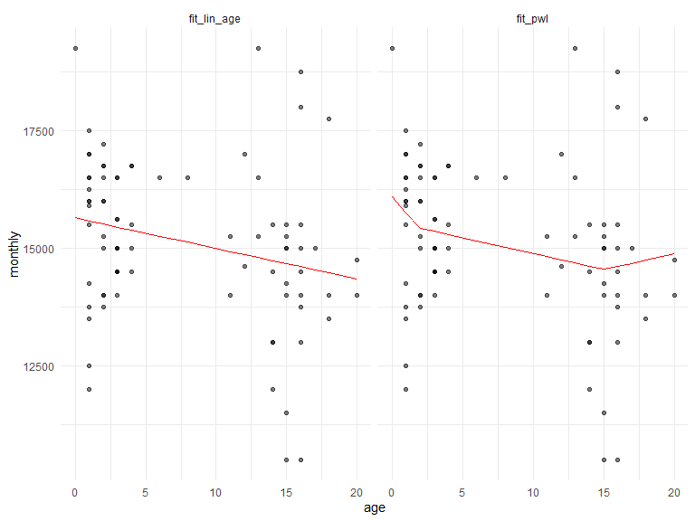

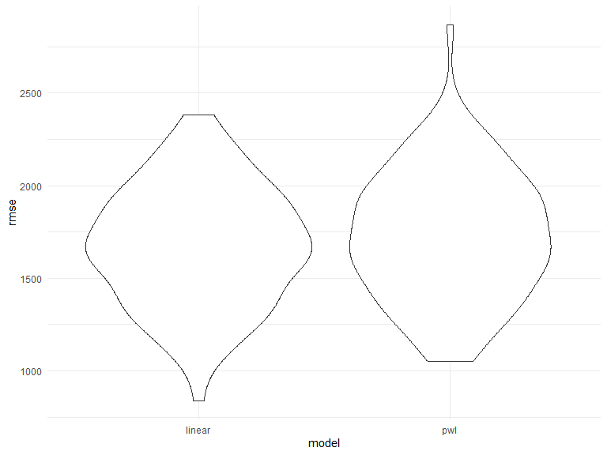

    ## 
    ## Call:
    ## lm(formula = monthly ~ . - vacancy_rate, data = rent_df)
    ## 
    ## Residuals:
    ##     Min      1Q  Median      3Q     Max 
    ## -3062.0  -643.7  -101.3   567.2  2958.3 
    ## 
    ## Coefficients:
    ##               Estimate Std. Error t value Pr(>|t|)    
    ## (Intercept)  1.237e+04  4.928e+02  25.100  < 2e-16 ***
    ## age         -1.442e+02  2.092e+01  -6.891 1.33e-09 ***
    ## taxes        2.672e+02  5.729e+01   4.663 1.29e-05 ***
    ## sq_footage   8.178e-03  1.305e-03   6.265 1.97e-08 ***
    ## ---
    ## Signif. codes:  0 '***' 0.001 '**' 0.01 '*' 0.05 '.' 0.1 ' ' 1
    ## 
    ## Residual standard error: 1132 on 77 degrees of freedom
    ## Multiple R-squared:  0.583,  Adjusted R-squared:  0.5667 
    ## F-statistic: 35.88 on 3 and 77 DF,  p-value: 1.295e-14

Based on RMSE, there a piecewise linear model does not improve the
association between age and monthly rent. So, a more parsimonious model
including all the significant variables is the recommended model for the
relationship between monthly rent and other variables. The model
accounts for about 57% of the variability in the monthly rental. This
means that there are other factors that account for over 40% of the
variability in monthly rent prices for the homes in the dataset. The
final model states that for each year a property grows older, the
monthly rent falls 144 dollars holding taxes and square footage
constant. For each unit rise in taxes, the monthly rent rises 267
dollars holding the age and square footage of a home constant. And, for
each hundred square feet, the monthly rent rises about 82 cents.
